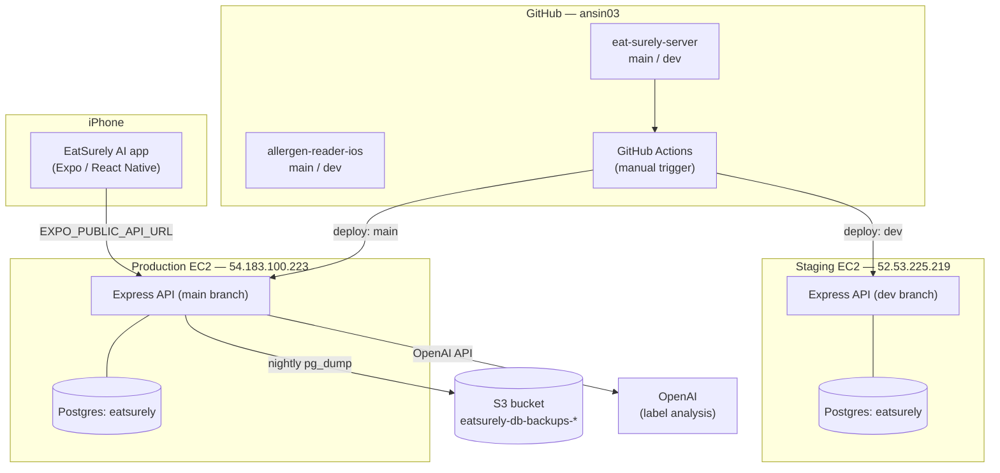

# EatSurely AI — Architecture & Deployment

What runs where, how a change gets from your laptop to production, and where the data lives. Written as a reference to come back to, not a one-time summary.

## System at a glance

The frontend's `EXPO_PUBLIC_API_URL` currently still points at `api.eat-surely.com`, which is not yet wired to the production box above — see **Known gaps** at the bottom.

## The three pieces

### 1. Frontend — `allergen-reader-ios`

Expo / React Native app, product name "EatSurely AI" (`com.eatsurely.app`). Screens for login, scanning, results, history, settings. Talks to the backend over plain `fetch` calls in `src/services/api.ts`.

The API base URL is *not* hardcoded — it comes from `EXPO_PUBLIC_API_URL`, set per environment via `.env.development` / `.env.production` at the project root (Expo loads these automatically; no extra config needed). This means switching environments never requires a code change.

### 2. Backend — `eat-surely-server`

Express + TypeScript, using Prisma as the ORM against PostgreSQL. Routes: `/api/health`, `/api/auth/*` (signup, login, forgot/reset password, onboarding, account deletion), `/api/analyze` (sends the scanned label to OpenAI and returns an allergen verdict), `/api/allergens`, `/api/history`. Auth is JWT-based; passwords are hashed with bcrypt.

This repo lives separately from the frontend — it wasn't in `allergen-reader-ios` at all; it was found as its own GitHub repo once the original production server became unreachable (see **History** below).

### 3. Database — PostgreSQL via Prisma

Each running copy of the backend has its own local PostgreSQL instance (not a shared/managed database). Schema is defined once in `prisma/schema.prisma` — three tables: `User`, `Allergen`, `Scan`.

## Environments

| Environment | Git branch | Where it runs | Database | Notes |
|---|---|---|---|---|
| **Local dev** | `dev` | Your Mac + Expo Go, reached over a Cloudflare tunnel (URL changes each session) | `allergen_reader_dev` | Fastest loop; nothing here is durable |
| **Staging** | `dev` | `52.53.225.219:4000` (eatsurely-dev EC2) | `eatsurely` (local Postgres on that box) | Runs via pm2 as `eatsurely-staging`; uses Prisma *migrations* (versioned schema changes) |
| **Production** | `main` | `54.183.100.223:4000` (eatsurely-prod EC2) | `eatsurely` (local Postgres on that box) | Runs via pm2 as `eatsurely-production`; nightly backups to S3 |

Every environment has its own `JWT_SECRET` and its own database — a bug or bad migration in one can't touch another.

## How a deploy actually happens

1. Work happens on the `dev` branch of the relevant repo, tested locally first.
2. Push to `origin/dev`.
3. Deploy to **staging**: SSH into `52.53.225.219`, `git pull` the `dev` branch, `npm install`, `npm run build`, `pm2 restart eatsurely-staging`.
4. Once verified on staging, open a PR from `dev` → `main` and merge.
5. Deploy to **production**: same steps, but on `54.183.100.223`, checking out `main` and restarting `eatsurely-production`.

A GitHub Actions workflow (`.github/workflows/deploy.yml` in `eat-surely-server`) automates exactly this — triggered manually from the Actions tab, choosing `staging` or `production`. It needs two secrets per GitHub Environment (`DEPLOY_HOST`, `DEPLOY_SSH_KEY`) that haven't been added yet, so for now deploys are done by hand over SSH as described above.

## Backups

Every night at 3am UTC, a cron job on the production box (`scripts/backup-db.sh`) dumps the production database, compresses it, and uploads it to `s3://eatsurely-db-backups-746412758643/backups/`. Access to that bucket is via a scoped IAM role attached to the instance — no AWS keys stored anywhere on disk. Backups older than 30 days delete themselves automatically (an S3 lifecycle rule), so storage cost stays close to zero.

Staging isn't backed up — losing staging data isn't a real problem, so it wasn't worth the extra complexity.

## A bit of history, for context

The app was originally live on the App Store, pointing at a single EC2 server that ran both the backend and its database together, first reachable at a raw IP via a free `nip.io` hostname, later via the real domain `api.eat-surely.com`. That original server (IP `3.238.135.237`) is no longer reachable — it appears to have been stopped or terminated at some point, and whatever real user data it held is presumably gone with it. That's the reason this whole dev/staging/prod split and the backup system exist now.

A second, unrelated EC2 instance (`18.145.179.98`) exists and only ever served the marketing website (the public eat-surely.com landing page) — it was never the app's backend, but `api.eat-surely.com`'s DNS currently resolves through Cloudflare to that box, which is why hitting that URL returns the marketing site / a 405 error instead of a real API response.

## Known gaps — worth closing eventually

- `api.eat-surely.com` doesn't route to the real production backend (`54.183.100.223`) yet — it needs DNS repointed, or the marketing box's nginx configured to reverse-proxy `/api/*` there.
- `main` hasn't received the `dev` branch's environment-loading bug fix and Prisma migration workflow — production is still running the older `db push` convention until `dev` is merged in.
- GitHub Actions deploy secrets (`DEPLOY_HOST`, `DEPLOY_SSH_KEY`) aren't configured yet, so the automated workflow exists but has never actually been run.
- Backups have never been test-restored — a backup that's never been restored from is unverified.

---

*Written to reflect the state of the system as of the work done together in this project. Server IPs, bucket names, and branch conventions may drift over time — treat this as a map, and verify against the actual servers/repos if something here seems stale.*
